# 模型评测功能需求文档

## 一、功能总览

| 序号 | 页面/功能 | 核心能力 | 原始需求依据 |
|---|---|---|---|
| 1 | 评测任务列表 | 查看、搜索、筛选、排序和管理全部评测任务 | 1.3.2.5.1.4.7.2.1、1.3.2.5.1.4.7.2.2 |
| 2 | 创建评测任务 | 选择模型类型、评测任务、模型版本、数据集、指标和基础参数并开始测评 | 1.3.2.5.1.4.7.1.1、1.3.2.5.1.4.7.1.2、1.3.2.5.1.4.7.6.3 |
| 3 | 任务详情与执行监控 | 查看状态流程、阶段时间、进度、实时日志、资源占用和完整配置 | 1.3.2.5.1.4.7.1.3、1.3.2.5.1.4.7.2.3 |
| 4 | 综合测评报告 | 成功后生成并下载 PDF 或 HTML 报告 | 1.3.2.5.1.4.7.3.1 |
| 5 | 可视化结果看板 | 查看核心指标、雷达图、柱状图、折线图、指标详情和数据导出 | 1.3.2.5.1.4.7.3.2、1.3.2.5.1.4.7.3.3 |
| 6 | 模型对比 | 在统一数据集和任务基准下对比两个或多个模型或版本 | 1.3.2.5.1.4.7.4 |
| 7 | 公开数据集 | 查看公开数据集列表、详情、评价指标建议、Schema 和版本 | 1.3.2.5.1.4.7.5.1 |
| 8 | 上传数据集 | 上传 JSONL/CSV 数据集并查看数据格式校验结果 | 1.3.2.5.1.4.7.5.2 |
| 9 | 数据集选用、共享与隔离 | 在公开/我的数据集中选用数据，向团队成员授予只读或编辑权限 | 1.3.2.5.1.4.7.5.3 |
| 10 | 测评流程设计器 | 配置阶段、参数、顺序、依赖和可选阶段 | 1.3.2.5.1.4.7.6.1 |
| 11 | 指标库与配置方案 | 在流程模板的指标计算阶段分类查看指标、配置权重并统一管理和应用 | 1.3.2.5.1.4.7.6.2、1.3.2.5.1.4.7.6.3 |
| 12 | 在线文档中心 | 提供结构化导航、评测方法说明和全文搜索 | 1.3.2.5.1.4.7.7.1 |
| 13 | API 接口文档 | 展示 REST API 详情、认证权限和在线调试 | 1.3.2.5.1.4.7.7.2 |
| 14 | 代码示例库 | 提供 Python、cURL、Java 示例及可下载项目 | 1.3.2.5.1.4.7.7.3 |

> 范围约束：本文档只规定原始需求明确要求的能力和已确认的创建任务交互。创建任务采用单页右侧弹窗，不展示四步导航、分块标题或配置确认页；模型对比不增加数量上限。

## 二、详细功能需求

### 2.1 评测任务列表

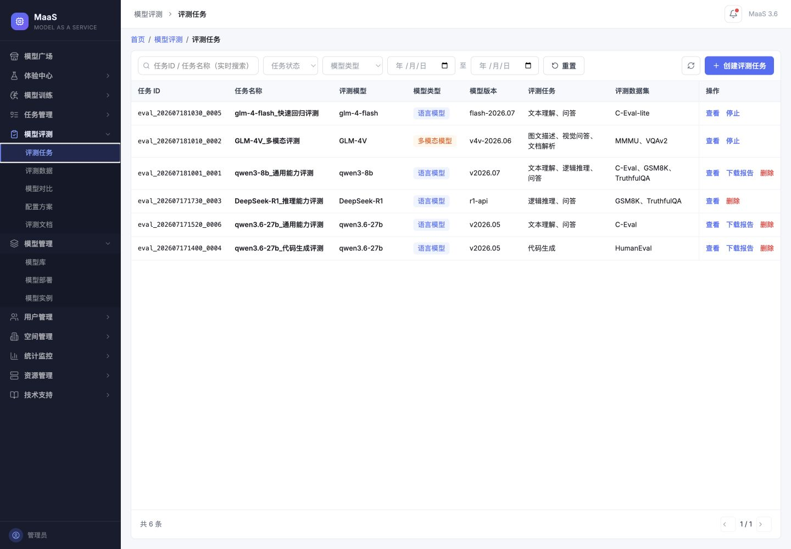

**原始需求依据**：任务列表视图、任务操作控制。

**核心功能**：使用表格集中展示历史和当前评测任务，并提供查看、停止、删除和下载报告入口。

**用户操作流程**：进入评测任务 → 输入任务 ID/名称或设置筛选条件 → 点击表头排序 → 查看匹配任务 → 执行行内操作。

**列表字段规则**：

| 字段 | 展示规则 |
|---|---|
| 任务 ID | 独立列完整展示，不与任务名称合并 |
| 任务名称 | 独立列展示，点击名称可进入详情 |
| 评测模型 | 展示参与该任务的模型名称 |
| 模型类型 | 语言模型或多模态模型 |
| 模型版本 | 独立列完整展示 |
| 评测任务 | 展示所选一个或多个任务类型 |
| 评测数据集 | 展示所选数据集 |
| 创建时间 | 独立列展示，表头支持升序/降序 |
| 当前状态 | 排队中、运行中、成功、失败、已停止；表头支持升序/降序 |
| 操作人 | 独立列展示任务创建用户 |
| 操作 | 查看；排队中/运行中显示停止；成功显示下载报告；成功/失败显示删除 |

**筛选与搜索规则**：

- 状态筛选：初始为全部状态；可按排队中、运行中、成功、失败、已停止筛选。
- 模型类型筛选：初始为全部模型；可按语言模型、多模态模型筛选。
- 创建时间筛选：初始为空；可按开始日期和结束日期筛选。
- 搜索：初始为空；输入任务 ID 或任务名称后实时过滤；支持一键清空。
- 排序：初始按创建时间降序，用户可切换创建时间或状态的升序/降序。
- 重置：清空搜索词和全部筛选条件。

**系统规则**：列表数据必须包含原始需求规定的全部核心字段；状态和创建时间排序作用于当前筛选结果；行内操作由任务当前状态决定。

**交互设计**：点击状态或创建时间表头切换升序/降序；停止和删除均先弹出确认对话框；成功任务点击“下载报告”直接下载报告。

**产品设计**：必需字段不得仅作为二级灰字合并展示；表格内容超出可视宽度时仅表格区域横向滚动，操作列固定在右侧。

**异常处理**：无匹配任务时显示“暂无符合条件的评测任务”；列表获取失败时保留当前条件并提示重新加载；重复点击操作时防止重复提交。

### 2.2 创建评测任务

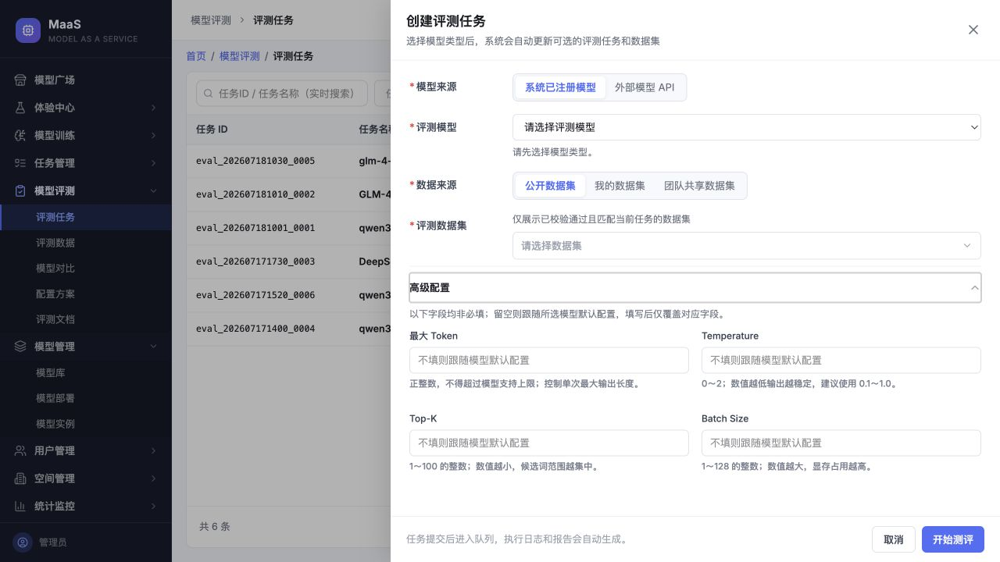

**原始需求依据**：模型类型选择、测评任务配置、任务启动、配置方案应用。

**核心功能**：在一个连续的右侧弹窗内完成模型、评测任务、流程模板和数据集配置。流程模板是唯一配置方案入口，同时保存执行阶段、阶段参数以及“指标计算”阶段的指标、权重和结构化样本计算范围。选择模板后统一回填全部流程配置，不再单独选择指标方案。最大 Token、Temperature、Top-K、Batch Size 位于默认收起的“高级配置”中。

**用户操作流程**：填写任务名称 → 选择模型类型 → 多选评测任务 → 按需选择一个流程模板 → 指定系统已注册模型或外部模型 API 与版本 → 选择评测数据集及版本 → 查看模板带出的执行流程、参数、指标和权重 → 按需展开“高级配置”并覆盖参数 → 点击“开始测评”。流程模板非必选；不使用模板时，系统按已选任务带出推荐指标。

**新增字段规则**：

| 字段 | 类型 | 必填 | 初始默认值 | 规则 |
|---|---|---|---|---|
| 任务名称 | 文本 | 是 | 系统按 `eval_YYYYMMDDHHmm` 自动生成 | 可修改，用于列表和详情识别任务 |
| 模型类型 | 单选 | 是 | 无，用户手动选择 | 语言模型、多模态模型 |
| 评测任务 | 多选 | 是 | 默认不选择，由用户手动选择 | 选择模型类型后显示候选项；语言模型：文本理解、代码生成、逻辑推理、问答；多模态模型：图文描述、视觉问答、文档解析 |
| 流程模板 | 单选 | 否 | 不使用流程模板 | 选择模型类型后可用；仅展示与当前模型类型匹配且当前用户有权使用的流程模板，并显示名称和当前版本；最多选择一个；模板同时包含流程阶段、阶段参数、指标及权重 |
| 模型来源 | 单选 | 是 | 系统已注册模型 | 可切换为外部模型 API |
| 评测模型 | 单选 | 条件必填 | 无，用户手动选择 | 选择系统已注册模型时必填 |
| API 地址 | URL | 条件必填 | 无，用户手动填写 | 选择外部模型 API 时必填 |
| 模型版本 | 文本/单选 | 是 | 初始无；选中系统模型后带出其推荐版本 | 可切换其他版本；外部模型由用户填写 |
| 数据来源 | 单选 | 是 | 公开数据集 | 可切换为我的数据集 |
| 评测数据集 | 多选 | 是 | 无，用户手动选择 | 只展示匹配模型类型、评测任务且校验通过的数据集 |
| 数据集版本 | 单选 | 是 | 选中数据集后默认其推荐版本 | 可切换其他版本 |
| 评估指标 | 系统回填 | - | 选中评测任务后使用推荐指标 | 用户不可在创建任务时直接编辑；选择流程模板后使用其“指标计算”阶段保存的指标 |
| 指标权重 | 系统回填 | - | 推荐指标自动等分为 100% | 用户不可在创建任务时直接编辑；选择流程模板后使用其“指标计算”阶段保存的权重 |
| 高级配置 | 折叠面板 | 否 | 收起 | 标题行仅显示“高级配置”和展开箭头，不显示参数摘要；点击整行展开或收起 |
| 最大 Token | 数字 | 否 | 空 | 不填则跟随模型默认配置；填写时必须为正整数且不得超过模型支持上限；控制单次最大输出长度 |
| Temperature | 数字 | 否 | 空 | 不填则跟随模型默认配置；取值 0～2，支持小数；数值越低输出越稳定，建议 0.1～1.0 |
| Top-K | 数字 | 否 | 空 | 不填则跟随模型默认配置；取值为 1～100 的整数；数值越小候选词范围越集中 |
| Batch Size | 数字 | 否 | 空 | 不填则跟随模型默认配置；取值为 1～128 的整数；数值越大显存占用越高 |
| 参数来源 | 系统记录 | - | 模型默认 | 可为模型默认、配置方案或自定义；在任务详情和报告中回显 |

**模型类型联动规则**：

| 当前模型类型 | 评测任务候选项 | 数据集联动 |
|---|---|---|
| 语言模型 | 文本理解、代码生成、逻辑推理、问答，可多选 | 只显示适用于语言模型且至少匹配一个已选任务的数据集 |
| 多模态模型 | 图文描述、视觉问答、文档解析，可多选 | 只显示适用于多模态模型且至少匹配一个已选任务的数据集 |

**流程模板应用规则**：

| 字段 | 选择数量 | 自动回填内容 | 边界规则 |
|---|---|---|---|
| 流程模板 | 0 或 1 个 | 执行阶段及顺序、阶段启用状态、预处理和后处理参数、模型推理参数、指标计算阶段的指标、权重与样本计算范围 | 不回填评测模型、模型版本、评测数据集及数据集版本；创建任务时指标、权重和样本计算范围只读 |

用户从配置方案列表点击“应用到任务”时，系统使用模板的适用模型类型初始化创建弹窗，评测任务仍由用户选择。用户在创建弹窗中主动选择模板时，不修改用户已选的模型类型和评测任务。“方案应用结果”必须显示流程模板名称、当前版本、执行流程、推理参数、指标及权重。指标和权重按模板当前版本锁定，如需修改应重新选择模板或返回流程模板编辑。

**系统规则**：切换模型类型时立即刷新任务、流程模板和数据集候选项，并清除不兼容的已选模型、任务、流程模板、数据集和指标；切换评测任务时只刷新数据集和未选择模板时的推荐指标，不刷新或清除兼容的已选流程模板。流程模板按模型类型匹配，必须读取配置方案库中的当前版本，不能使用页面内另行维护的固定选项。应用流程模板时统一替换流程、阶段参数、指标和权重，不得虚构或自动选择模板未保存的模型和数据集。高级配置中用户填写的值优先于模板值，模板未配置的字段继续读取模型默认配置；任务创建时固化流程模板名称与版本、最终生效指标和权重、参数来源、模型及版本。配置合法后生成任务 ID，状态置为“排队中”，写入后台队列并跳转任务监控页。

**交互设计**：模型类型使用二选一控件；评测任务使用可多选按钮且创建弹窗打开时默认不选择任何任务；只设置一个“流程模板”单选下拉框，不增加额外步骤。未选择模型类型前禁用流程模板字段，选定模型类型后立即可选。选中模板后紧邻展示“方案应用结果”，分行显示模板版本、执行流程、推理参数、评估指标及权重。“高级配置”初始收起，标题右侧只显示展开箭头；底部固定“取消”“开始测评”按钮；不显示独立指标方案、评测方式、评估方法、四步导航、配置确认和费用预估。

**产品设计**：所有核心字段在同一滚动弹窗内连续展示；低频参数统一收入高级配置，默认不占用主表单空间；通过“留空继承、填写覆盖”减少开关和状态判断；错误信息固定在表单内容顶部；字段顺序与用户决策顺序一致。

**异常处理**：必填项缺失时不提交并汇总提示；外部 API 地址格式错误时提示修正；切换类型后无可用数据集时提示更换任务或上传数据集；高级配置中已填写参数的格式或范围不合法时就近提示并禁止提交；空字段无法读取平台模型默认值时由模型服务使用自身默认配置；提交失败时保留当前配置。

### 2.3 任务详情与执行监控

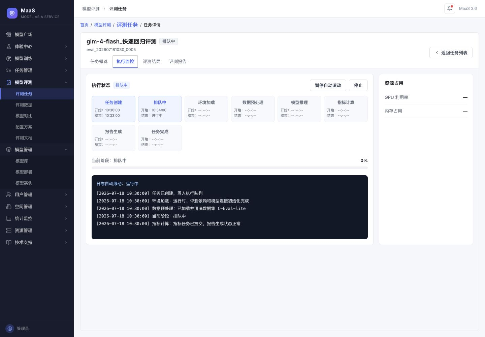

**原始需求依据**：测评执行与监控、任务状态与详情追踪。

**核心功能**：实时展示任务阶段、进度、状态、日志、GPU/内存占用，并完整回显创建配置。

**用户操作流程**：创建任务后自动进入监控 → 查看状态流程和进度 → 滚动查看日志 → 查看资源占用 → 必要时停止任务 → 在任务概览查看完整配置。

**详情字段规则**：任务 ID、名称、模型类型、评测任务、模型来源、模型名称、模型版本、外部 API 地址（如使用）、数据集及版本、指标及权重、流程模板名称与版本（如使用）、基础参数、操作人必须与创建时配置一致。

**监控字段规则**：

| 字段 | 规则 |
|---|---|
| 状态标签 | 监控过程展示排队中、执行中、已完成；失败和已停止展示对应终态 |
| 阶段流程 | 从创建到完成展示各阶段，并显示每阶段开始和结束时间 |
| 当前进度 | 进度条和百分比同步展示 |
| 实时日志 | 可滚动文本框；包含环境加载、数据预处理、模型推理、指标计算输出和错误记录 |
| GPU 利用率 | 任务运行期间实时展示 |
| 内存占用 | 任务运行期间实时展示 |

**系统规则**：提交成功后进入执行队列；状态、阶段、进度、日志和资源数据由后台任务实时更新；排队中或运行中任务可停止；详情回显使用任务创建时保存的配置快照。

**交互设计**：时间轴区分已完成、当前和未开始阶段；日志区可滚动并区分普通和错误日志；点击“停止”弹出确认对话框，确认后发送停止指令。

**产品设计**：任务详情包含“任务概览、执行监控、评测结果、评测报告”页签；监控区在同屏展示主状态和资源占用。

**异常处理**：状态获取失败时保留上一次结果并提示刷新；日志暂时为空时显示等待信息；停止失败时恢复原状态并显示后台错误；失败任务在详情中显示错误日志和失败原因。

### 2.4 综合测评报告

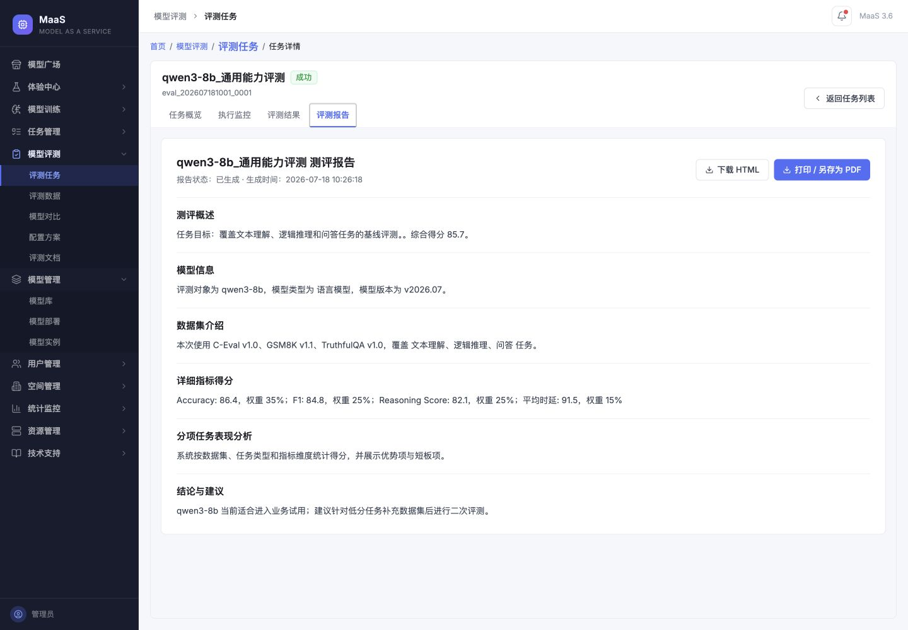

**原始需求依据**：综合测评报告生成。

**核心功能**：成功任务自动生成 PDF 或 HTML 综合报告，并提供下载入口。

**用户操作流程**：任务成功 → 系统生成报告 → 用户在任务列表点击“下载报告”，或在详情“评测报告”页签查看并下载 HTML/PDF。

**报告内容规则**：

- 测评概述：任务目标、模型信息、数据集介绍。
- 详细指标得分：展示准确率、BLEU 等本任务已选指标。
- 分项任务表现分析：按评测任务和数据集展示表现。
- 结论与建议：基于评测结果输出结论和改进建议。

**系统规则**：仅任务状态为“成功”时生成正式报告；报告使用任务配置和最终结果快照；支持 PDF 或 HTML 格式；任务列表必须提供“下载报告”按钮。

**交互设计**：报告生成中显示状态；生成后显示格式化内容和下载按钮；浏览器打印可用于另存为 PDF。

**产品设计**：报告按原始需求章节顺序展示，标题、数据和结论层级清晰。

**异常处理**：未成功任务显示“报告将在任务成功后自动生成”；生成失败时显示失败原因并允许重新触发；下载失败时提示重试。

### 2.5 可视化结果看板与指标详情

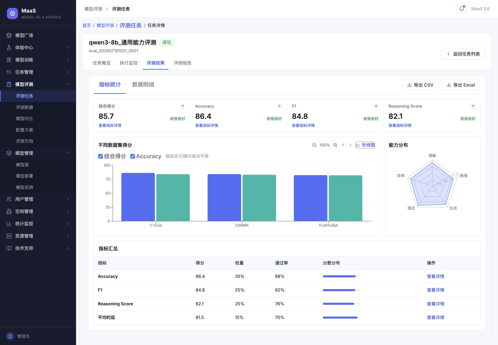

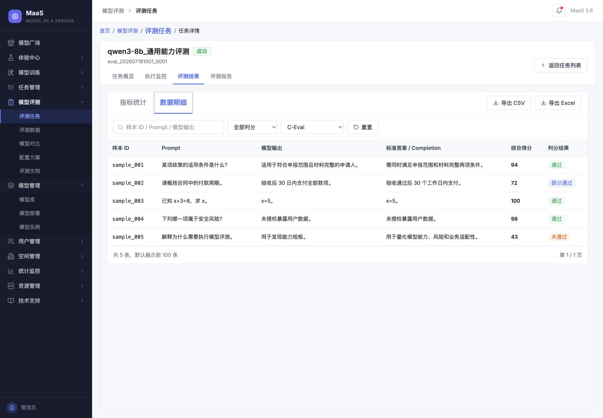

**原始需求依据**：可视化结果看板、指标详情查看。

**核心功能**：通过核心指标卡片、雷达图、柱状图和折线图展示完成任务的结果，并支持指标下钻和数据导出。

**用户操作流程**：进入成功任务详情 → 打开“评测结果” → 查看核心指标 → 切换柱状图/折线图并操作图例、缩放和平移 → 点击指标卡片查看详情 → 导出 CSV/Excel。

**展示字段规则**：核心指标卡片展示指标名称、数值和颜色或趋势箭头；柱状图展示不同数据集得分；雷达图展示不同能力维度；折线图展示性能随参数变化的趋势；指标表展示指标、得分和权重；数据明细展示样本输入、模型输出、标准答案和得分。

**系统规则**：仅成功任务展示最终看板；图表和表格使用同一结果数据；指标详情展示计算方式、子项得分和样本分布；导出内容与当前任务结果一致。

**交互设计**：点击图例显示/隐藏数据系列；悬停数据点显示详细数值；“不同数据集得分”和“性能随参数变化趋势”的缩放范围均为 80%～150%，默认显示 100%，每次按 10% 调整，并提供左移、右移；点击指标卡片或“查看详情”从右侧打开指标详情；CSV 和 Excel 分别下载。

**产品设计**：顶部使用紧凑指标卡片；主体同时包含雷达、柱状/折线和指标表；图表纵轴统一为相同得分范围，避免误读。

**异常处理**：未成功任务显示暂无结果；没有共同维度时不绘制对应图表并说明原因；导出失败时提示重试。

### 2.6 模型对比

**原始需求依据**：模型对比分析全部要求。

**核心功能**：从已完成评测结果中选择两个或多个模型（也支持同一模型的不同版本或不同评测批次），系统根据首个结果自动确定统一数据集、数据集版本和评测任务，再并排比较得分。

**用户操作流程**：进入模型对比 → 点击“添加对比模型” → 从已完成评测结果中搜索并选择首个模型 → 系统自动确定对比条件并过滤可比较结果 → 继续选择至少一个模型 → 确认选择 → 查看多栏结果、差异表、叠加雷达图和差异摘要 → 保存对比场景。

**字段规则**：

| 字段 | 初始默认值 | 规则 |
|---|---|---|
| 搜索模型评测结果 | 空 | 支持按模型名称、模型版本、评测任务名称/ID、数据集和任务类型搜索 |
| 对比模型 | 无，用户手动选择 | 多选，候选项只来源于成功的评测任务；模型名称为主信息，同时展示版本、任务、数据集及版本、完成时间和总体得分；至少选择 2 个，不设置原始需求之外的数量上限 |
| 统一数据集 | 选择首个模型后自动确定 | 只读展示；优先选择可覆盖更多已完成评测结果的数据集 |
| 数据集版本 | 选择首个模型后自动确定 | 只读展示；所有参与结果必须使用同一数据集版本 |
| 统一评测任务 | 选择首个模型后自动确定 | 只读展示；所有参与结果必须完成同一任务类型 |
| 查看不可比较结果 | 默认关闭 | 开启后展示不满足当前条件的已完成结果；候选项不可勾选，并明确显示数据集、版本或任务类型不一致的原因 |
| 场景名称 | 无，用户手动填写 | 保存对比模型组合和基准时填写 |

**系统规则**：前端以模型为主进行选择，提交及保存时仍记录对应评测任务 ID；首个结果存在多个数据集或任务类型时，系统选择可匹配成功任务数量最多的组合为本次对比条件；默认列表仅显示符合统一条件的成功结果；不符合条件的结果仅在用户主动查看时出现且不可选择；对比项仅使用所有选中结果共同具备的指标；所有图表保持相同坐标范围；保存场景时记录模型/版本组合和统一基准。

**交互设计**：页面主区只展示已选模型卡片和“添加对比模型”，不要求用户预先理解数据集、版本和任务的依赖关系；选择动作在右侧抽屉完成，首选后立即展示系统自动确定的对比条件；搜索和“查看不可比较结果”位于候选列表上方；已选数量实时展示，少于 2 个时“确认选择”不可用；取消或关闭抽屉不改动页面上已确认的模型组合；结果第一列为固定对比项，模型列支持横向滚动；最优值使用绿色或向上标记，最差值使用红色或向下标记；可开关高亮。

**产品设计**：每个模型列展示模型、版本、任务 ID、核心指标和详细指标；叠加雷达图用不同颜色区分模型；顶部摘要列出综合得分最高模型、得分更高的共同指标和得分相同指标。

**异常处理**：首选结果没有其他可比较项时保留当前选择，并允许查看不可比较结果及具体原因或取消首选后重选；少于两个模型时不生成对比结果并提示继续选择；候选数据发生变化导致已选结果不再兼容时自动移除失效项并提示；无共同指标时显示无法生成雷达图；保存场景缺少名称时不提交。

### 2.7 公开数据集

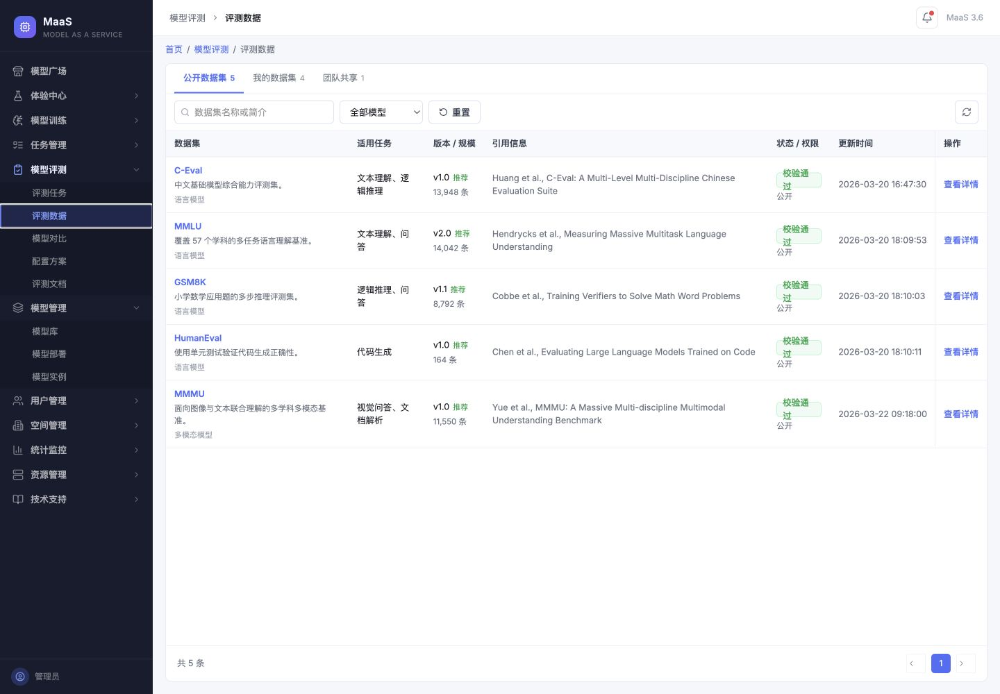

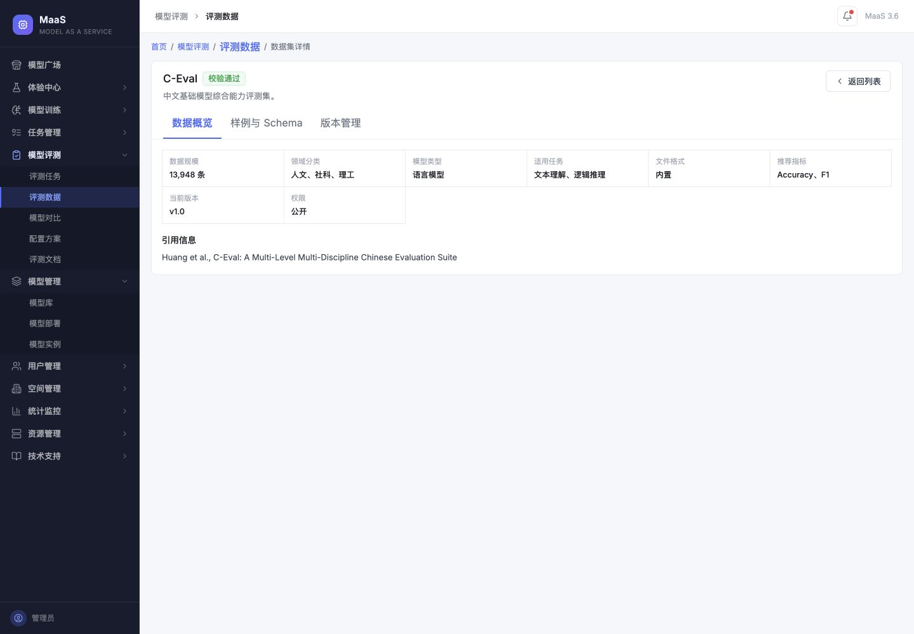

**原始需求依据**：公开数据集管理。

**核心功能**：集中展示并维护 MMLU、C-Eval、GSM8K 等公开测评集，支持详情预览和版本选择。

**用户操作流程**：进入评测数据 → 打开“公开数据集” → 搜索或浏览 → 点击名称/查看详情，或由管理员点击“编辑” → 查看或修改概览、样例、评价指标建议、Schema、推荐版本和版本数据。

**列表字段规则**：数据集名称、简介、适用任务、版本号、数据规模、引用信息必须直接展示；推荐版本显示“推荐”标识。

**详情字段规则**：展示数据规模、领域分类、模型类型、适用任务、文件格式、评价指标建议、样例数据、Schema、引用信息和所有版本；评价指标建议根据适用任务自动生成且只读；版本列表标注推荐版本并允许选择特定版本。

**系统规则**：公开数据集对所有有评测使用权限的用户可见；管理员可编辑公开数据集元数据、上传新版本并调整推荐版本；评价指标建议统一读取[任务与评价指标建议映射表](模型评测-评价指标建议映射表.md)，选择或修改适用任务后自动合并、去重并刷新，不允许上传者手动选择；未命中映射时显示“暂无评价指标建议”；创建任务默认使用推荐版本，用户可切换其他版本；历史任务保留创建时所选版本。

**交互设计**：评测数据顶部页签只显示“公开数据集、我的数据集、团队共享、平台用户数据集”名称，不在页签后展示数量统计；点击数据集名称或“查看详情”进入详情页；上传或编辑公开数据集时，选择适用任务后以只读方式显示评价指标建议，并提示“系统根据适用任务自动生成，不需要手动配置”；公开数据集管理员行提供“编辑”按钮，复用我的数据集编辑页面及版本管理能力。

**产品设计**：引用信息使用独立列表列，不能只隐藏在详情页；简介在数据集名称下展示；“评价指标建议”使用系统映射结果，不配置权重，不覆盖流程模板中的实际指标和权重。

**异常处理**：列表为空时显示空状态；详情加载失败时可返回列表；版本不可用时提示重新选择。

### 2.8 上传数据集

**原始需求依据**：自定义数据集接入。

**核心功能**：用户通过“上传数据集”进入上传页，填写元信息、上传 JSONL/CSV 文件并查看数据格式校验结果。

**用户操作流程**：在“我的数据集”点击“上传数据集” → 填写名称、描述和适用任务 → 选择 JSONL/CSV 文件 → 系统自动校验 → 查看校验结果/错误；如需更换文件，删除已上传文件后重新选择 → 点击“上传”进入我的数据集列表。

**新增字段规则**：

| 字段 | 必填 | 初始默认值 | 规则 |
|---|---|---|---|
| 数据集名称 | 是 | 无，用户手动填写 | 文本 |
| 数据集描述 | 是 | 无，用户手动填写 | 说明数据来源、用途和适用范围 |
| 模型类型 | 是 | 无，用户手动选择 | 语言模型或多模态模型，用于确定任务和数据格式规则 |
| 适用任务 | 是 | 无，用户手动选择 | 选择模型类型后显示对应任务 |
| 数据文件 | 是 | 无，用户手动上传 | 支持 JSONL、CSV；文件格式由扩展名识别，不要求用户另选 |

**Schema（数据格式说明）候选业务规则（待算法确认）**：

Schema 是数据集每条样本的字段协议，定义字段名称、数据类型、必填性和取值要求。产品定义对外协议和交互，评测算法确认执行程序真实需要的字段，后端按最终确认结果维护 Schema 配置。前端不得自行推断或写死 Schema。

**任务与字段映射候选方案**：

| 模型类型 | 适用任务 | 必填字段 | 选填字段 | 说明 |
|---|---|---|---|---|
| 语言模型 | 文本理解 | `input`、`answer` | `id`、`context`、`choices`、`category` | `input` 为题目或指令，`answer` 为标准答案 |
| 语言模型 | 问答 | `input`、`answer` | `id`、`context`、`choices`、`category` | 有上下文问答时使用 `context`，无上下文时可省略 |
| 语言模型 | 逻辑推理 | `input`、`answer` | `id`、`choices`、`rationale`、`category` | `rationale` 仅用于分析或过程评测，不默认参与答案判定 |
| 语言模型 | 代码生成 | `prompt`、`test` | `task_id`、`entry_point`、`language`、`canonical_solution` | `test` 为可执行测试用例；运行环境和安全限制由算法与后端确认 |
| 多模态模型 | 图文描述 | `image_url`、`answer` | `id`、`category` | `answer` 为参考描述；图片可使用 URL 或 ZIP 内相对路径 |
| 多模态模型 | 视觉问答 | `image_url`、`question`、`answer` | `id`、`category` | 问题与图片共同作为模型输入 |
| 多模态模型 | 文档解析 | `document_url`、`instruction`、`answer` | `id`、`page_range`、`category` | 文档可使用 URL 或 ZIP 内相对路径；`instruction` 说明解析目标 |

**字段字典候选方案**：

| 字段 | 类型 | 必填规则 | 取值与处理规则 |
|---|---|---|---|
| `id` / `task_id` | String | 选填 | 数据集版本内唯一；为空时系统按文件行号生成，只用于样本追踪 |
| `input` | String | 按任务必填 | 非空；存放题目、用户指令或待处理文本 |
| `context` | String | 选填 | 问答所需的背景材料；为空时只使用 `input` |
| `question` | String | 视觉问答必填 | 非空；与 `image_url` 共同组成输入 |
| `prompt` | String | 代码生成必填 | 非空；不得包含平台不支持的二进制内容 |
| `instruction` | String | 文档解析必填 | 非空；明确抽取、识别或结构化输出目标 |
| `answer` | String 或 String[] | 按任务必填 | 至少包含一个非空答案；数组表示多个可接受参考答案 |
| `choices` | String[] | 选填 | 至少两个选项；CSV 中使用 JSON 数组字符串保存 |
| `rationale` | String | 选填 | 标准推理过程；默认不直接参与最终答案评分 |
| `test` | String 或 String[] | 代码生成必填 | 至少一个测试用例；具体语言、执行器和沙箱规则由算法确认 |
| `entry_point` | String | 选填 | 待调用函数或类入口；使用时必须与 `test` 一致 |
| `language` | String | 选填 | 编程语言标识，如 `python`；为空时使用任务默认语言 |
| `canonical_solution` | String | 选填 | 参考实现，仅供分析，不作为模型输入 |
| `image_url` | String | 图文描述、视觉问答必填 | 支持 `http/https` URL 或 ZIP 内相对路径；资源必须可读取 |
| `document_url` | String | 文档解析必填 | 支持 `http/https` URL 或 ZIP 内相对路径；文件类型由平台白名单控制 |
| `page_range` | String | 选填 | 页码范围，如 `1-5`；不得超出文档实际页数 |
| `category` | String | 选填 | 样本分类标签，用于结果分组，不默认参与指标计算 |

**文件格式规则**：

- JSONL：UTF-8 编码，每行必须是一个完整 JSON Object；允许空行但校验时忽略；数组字段使用 JSON Array。
- CSV：UTF-8 编码，第一行为表头；字段名称与 Schema 完全一致；包含逗号、换行或双引号的值必须按 CSV 标准转义；数组字段使用 JSON 数组字符串。
- ZIP：仅用于包含图片或文档素材的多模态数据集；压缩包根目录必须包含且只能包含一个 `manifest.jsonl` 或 `manifest.csv`，素材通过相对路径引用；禁止绝对路径、`../` 路径穿越、加密压缩包和可执行文件。
- 扩展字段：允许保留 Schema 未定义的业务字段，但平台评测器默认忽略；不得与系统保留字段重名。
- 文件大小、单条文本长度和媒体数量上限由部署环境配置，前端从后端读取限制并展示，不在产品层固定写死。

**Schema 来源与版本规则**：

- 公开数据集使用该公开基准实际字段，由平台管理员录入或导入，评测算法确认其适配器后发布。
- 自定义数据集根据用户选择的“模型类型 + 适用任务”读取后端 Schema 配置，不根据上传文件表头自行生成规则。
- 后端以 `model_type + task_type + schema_version` 维护映射，并向前端返回字段名称、类型、必填性、说明和样例。
- 上传成功时将 Schema ID、Schema 版本和完整快照写入数据集版本；后续修改平台 Schema 不影响历史版本和历史评测任务。
- 数据集升级版本时重新校验；字段协议发生不兼容变化必须创建新数据集版本，不覆盖旧版本。
- 数据集详情页标题统一显示“Schema”，并展示当前所选版本的字段结构。

**Schema 校验与错误规则**：

- 依次校验文件类型、编码与语法、必填字段、字段类型、非空值、样本 ID 唯一性、媒体引用和任务专属约束。
- 任一必填字段缺失、类型不符或资源无法读取时，数据集状态为“校验失败”，不得用于创建评测任务。
- 错误结果至少包含文件名、行号或样本 ID、字段名称、错误原因和修复建议；页面优先展示前 5 条并显示错误总数。
- 校验通过后记录有效样本数、忽略空行数和 Schema 版本；校验过程删除或替换文件时，旧校验结果不得回写。
- 同一文件重复上传按新上传处理；是否判重由数据集名称和版本规则决定，不以文件名作为唯一标识。

**算法评审确认项**：

- 各任务的必填字段是否足以直接驱动当前评测执行器。
- `answer` 是否需要支持多个参考答案，以及不同指标如何处理多答案。
- 代码生成的 `test`、`entry_point`、语言和沙箱执行协议。
- 图文描述是否使用 `answer` 作为参考描述，是否需要单独的 `caption` 字段。
- 文档解析的输入文件类型、`instruction` 定义、标准答案格式和页码范围规则。
- 图片和文档采用 URL、对象存储 Key 或 ZIP 相对路径中的哪几种方式。

**校验规则**：检查文件格式、JSON/CSV 语法、必填字段和每条记录字段值；校验结果为校验中、校验通过或校验失败；失败时展示具体行号、缺失字段或格式错误；只有校验通过的数据集可用于创建任务。

**系统规则**：选择文件后自动进入校验中；完成后更新状态；删除已上传文件时同步清空文件名、文件输入值、校验状态、校验结果、错误信息、记录数和样例数据，旧文件仍在异步校验时不得回写结果；上传记录进入“我的数据集”；原始需求未规定文件大小上限，因此本文档不设固定上限。

**交互设计**：支持点击或拖拽选择文件；选择后显示文件名称和“删除文件”图标按钮，点击删除后恢复文件选择区域，用户可重新上传文件，包括再次选择同名文件；校验过程显示状态；“上传”按钮在未选择文件或校验中不可用，校验完成后可保存记录；按钮名称必须为“上传数据集”和“上传”。

**产品设计**：上传页依次展示基础信息、类型与格式、数据上传；同时提供格式说明和样例文件下载。

**异常处理**：文件格式不支持、文件为空、JSON 语法错误、CSV 表头/列数错误、必填字段缺失时显示对应错误；读取失败时提示删除后重新选择文件；文件校验过程中被删除时终止该文件结果回写，不显示旧文件校验结果。

### 2.9 数据集选用、共享与隔离

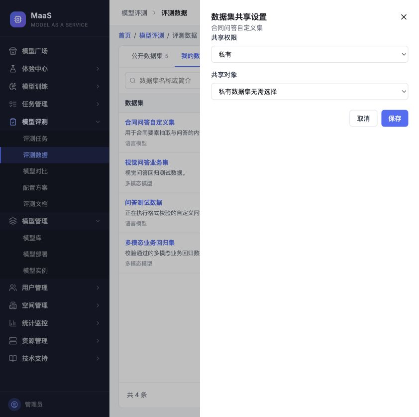

**原始需求依据**：数据集应用与权限。

**核心功能**：创建任务时从公开数据集和我的数据集选择数据；我的数据集可共享给团队内其他用户并授予只读或编辑权限；用户只能访问自己上传或被授权的数据。

**用户操作流程**：选择我的数据集 → 点击“共享设置” → 选择团队成员/团队范围 → 选择只读或编辑 → 保存；被授权用户在团队共享数据中查看，并在创建任务的“我的数据集”范围内选择可用数据。

**字段规则**：

| 字段 | 必填 | 初始默认值 | 规则 |
|---|---|---|---|
| 共享权限 | 是 | 当前数据集权限；新上传数据集为私有 | 私有表示不共享；也可选择只读或编辑 |
| 共享对象 | 条件必填 | 无，用户手动选择 | 权限为只读或编辑时必填；私有时禁用且无需选择 |

**系统规则**：只读用户可查看和使用，不能修改；编辑用户可按授权修改；未授权用户不可见；创建任务查询“我的数据集”时包含本人上传和被授权的数据；不同用户数据按所有者与授权关系逻辑隔离。

**交互设计**：共享设置从右侧抽屉打开；保存后立即更新权限；创建任务不额外增加第三种数据来源，公开数据与我的数据仍使用两个标签/切换项。

**产品设计**：数据列表用权限文字区分私有、只读、编辑；团队共享数据可单独查看，但创建任务时统一归入“我的数据集”可选范围。

**异常处理**：授权被撤销后立即禁止继续访问；任务提交前权限变化时提示重新选择；共享保存失败时保留原权限。

### 2.10 测评流程设计器

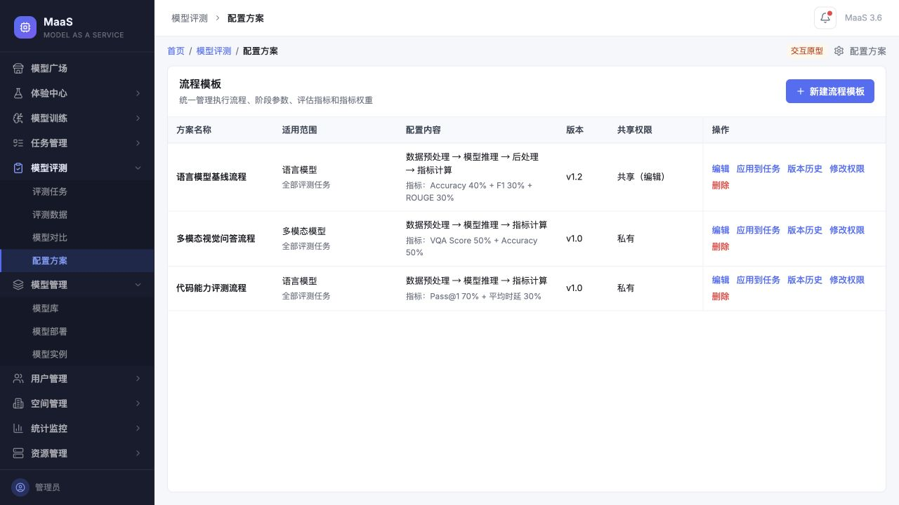

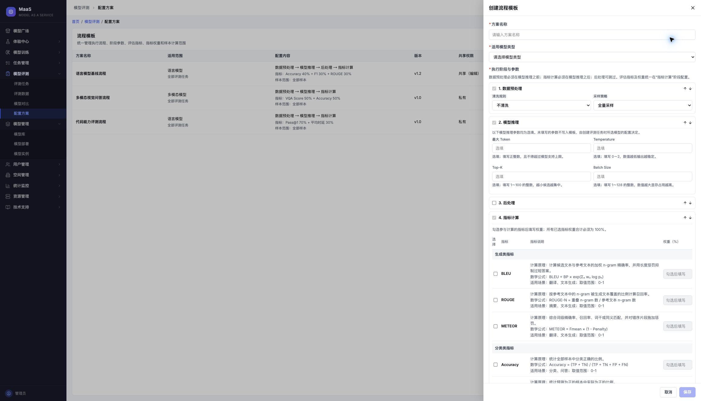

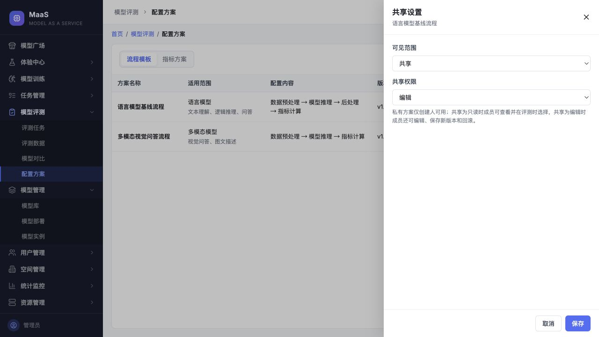

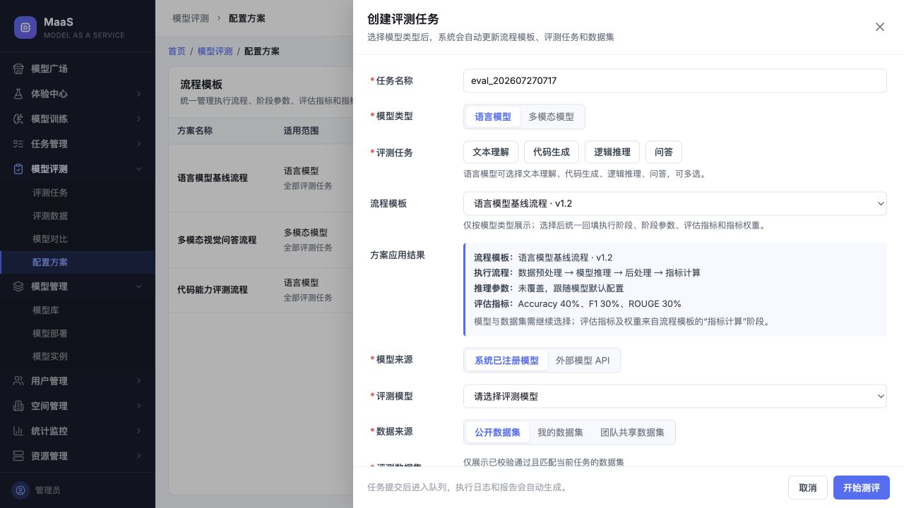

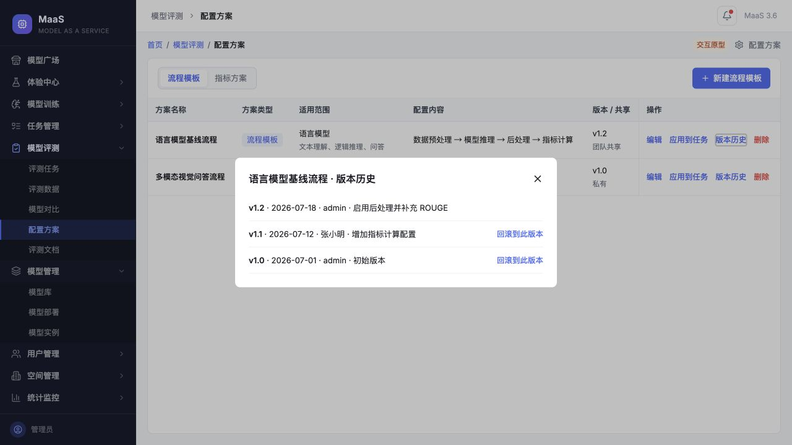

**原始需求依据**：测评流程设计器、流程模板管理。

**核心功能**：按“数据预处理 → 模型推理 → 后处理 → 指标计算”配置完整测评流程，每阶段可独立配置参数、调整顺序并保存模板。“模型推理”阶段直接展示四个可选参数，不使用创建评测任务中的“高级配置”折叠交互。“指标计算”阶段直接包含指标选择、权重和结构化样本计算范围，不再维护独立指标方案。创建人可将模板设为私有或共享，并为共享模板统一设置只读或编辑权限。

**用户操作流程**：进入配置方案 → 新建/编辑流程模板 → 加载或设置完整阶段、启用状态和参数 → 在“指标计算”阶段按类别勾选指标并设置权重 → 配置样本计算范围 → 处理阶段依赖、规则完整性和权重校验 → 设置“私有”或“共享”；选择“共享”后设置“只读”或“编辑” → 保存 → 查看版本历史或回滚。保存后可从列表点击“应用到任务”，创建任务弹窗只需选择该流程模板。

**阶段字段规则**：

| 阶段/字段 | 初始默认值 | 参数规则 |
|---|---|---|
| 适用模型类型 | 无，用户手动选择 | 语言模型或多模态模型 |
| 数据预处理 | 启用；不清洗；全量采样 | 可选择清洗规则与采样策略；“不清洗”避免未确认的数据变换 |
| 模型推理 | 启用；最大 Token、Temperature、Top-K、Batch Size 均为空 | 四个字段直接展示且均为选填，不显示“高级配置”标题、不折叠、不提供默认值；用户填写后按各字段取值范围校验，未填写的参数不写入模板 |
| 后处理 | 默认不启用 | 启用后填写后处理/标准化规则；可作为非必要阶段跳过 |
| 指标计算 | 启用；指标为空；样本计算范围为“全部样本” | 按生成、分类、代码生成、效率分类展示指标；配置方案模板不提供匹配类指标 Exact Match；至少选择一个指标；选择后自动等分权重并允许修改，保存时权重合计必须为 100%；样本计算范围可调整 |
| 可见范围 | 私有 | 可选择私有或共享；私有方案仅创建人可见 |
| 共享权限 | 只读 | 仅可见范围为共享时显示；可选择只读或编辑，不选择具体成员 |

**系统规则**：数据预处理必须在模型推理之前；启用后处理时必须位于模型推理与指标计算之间；指标计算必须在模型推理之后；违反依赖时禁止保存并明确提示。新建流程模板时，最大 Token、Temperature、Top-K、Batch Size 均为空且均为选填；空值不阻止保存，也不写入模板。用户填写参数后，系统按字段取值范围校验，不符合规则时禁止保存。应用模板创建评测任务时，模板仅覆盖已填写的推理参数，模板未填写的参数由任务所选模型的配置决定。编辑已有模板时按当前版本原值回填。指标计算阶段至少包含一个指标，已选指标权重合计必须为 100%。列表的阶段摘要和指标权重摘要必须取自当前版本，进入编辑必须回填当前版本的完整阶段、参数、指标和原权重。保存修改生成新版本；版本快照同时固化流程和指标计算配置；回滚时恢复所选历史版本的完整内容并生成新版本。系统记录创建人和方案归属用于鉴权，并在列表中展示创建人；创建人不在编辑表单或共享设置中修改。共享为只读时，其他有权访问用户只能查看和应用；共享为编辑时还可编辑、保存新版本和回滚。只有创建人可以修改共享权限和删除。

**交互设计**：阶段卡片提供启用复选框和上移/下移按钮；“模型推理”阶段下方直接展示最大 Token、Temperature、Top-K、Batch Size 四个输入框，不显示“高级配置”标题和展开/收起控件。四个字段不显示必填标识，初始均为空，使用“选填”占位提示；空值不提示错误，只有用户输入不合法时才在字段区域提示并禁用保存。“指标计算”阶段直接展示分类指标库，每个指标同一行展示名称、原理、公式、适用场景、范围、勾选框和权重输入框；未勾选指标时禁用其权重输入。权重合计实时展示，非 100% 时以错误色提示并禁用保存。编辑已有模板时各阶段、指标和参数按当前版本原值回填。依赖或参数错误就近显示。新建模板的“可见范围”默认私有；选择共享后显示“共享权限”，默认只读，可切换为编辑。点击“应用到任务”后，在创建弹窗中直接选中该流程模板并展示版本、执行流程、已填写的推理参数、指标和权重；评测模型与数据集仍由用户选择。创建评测任务中的“高级配置”继续独立使用默认收起的交互，不受流程模板页面影响。

**产品设计**：阶段按层级顺序纵向排列；参数只在阶段启用时展开；列表展示模板名称、适用模型/任务、阶段、版本、创建人和共享权限，不展示所属团队。创建人展示方案首次创建时记录的用户名称，后续协作者编辑或回滚不改变创建人。共享权限显示为“私有”“共享（只读）”或“共享（编辑）”。行内操作根据权限动态显示，避免只读用户看到不可执行的编辑入口。

**异常处理**：阶段依赖错误时不保存；模板名称为空时不保存；模型推理参数为空时正常保存，已填写参数存在格式错误或超出范围时，在对应字段附近提示并禁止保存；保存失败时保留编辑内容；加载编辑数据失败时不展示空白默认配置，提示重新加载；回滚失败时不改变当前版本；应用模板时忽略未填写的推理参数，不将其误判为方案缺失。权限被撤销后，用户再次打开或提交任务时系统重新校验权限并阻止访问；具有编辑权限的用户并发保存版本冲突时提示刷新后重试；共享设置保存失败时保留原权限。

### 2.11 流程模板内的指标库与权重配置

**原始需求依据**：评估指标选择与组合、配置方案管理。

**核心功能**：指标库嵌入流程模板的“指标计算”阶段，按生成、分类、代码生成、效率等任务类型分类展示，提供公式、原理、场景和范围；支持多选指标、设置权重和结构化样本计算范围。指标配置与完整流程一并保存、共享、版本化、回滚和应用，不单独生成指标方案。

**用户操作流程**：进入配置方案 → 新建或编辑流程模板 → 展开“指标计算”阶段 → 按类别查看指标 → 勾选多个指标 → 设置每项权重和样本计算范围 → 保存流程模板。创建评测任务时只选择一个有权使用的流程模板 → 系统自动带出指标、权重和样本计算范围 → 用户在“方案应用结果”中核对后继续选择模型和数据集并提交任务。

**指标规则**：生成类包含 BLEU、ROUGE、METEOR 等；分类类包含 Accuracy、Precision、Recall、F1 等；代码生成类包含 Pass@1；效率类包含平均时延；其他任务专用指标按任务类型归类。配置方案模板不提供匹配类指标 Exact Match；未应用模板时，系统仍可根据评测任务推荐适用指标。不提供或计算 `Reasoning Score`。每个指标必须分别展示计算原理、数学公式、适用场景和取值范围，不能以概念描述替代数学公式。核心公式示例：BLEU = BP × exp(Σₙ wₙ log pₙ)；ROUGE-N = 重叠 n-gram 数 / 参考文本 n-gram 数；METEOR = Fmean × (1 - Penalty)；Accuracy = (TP + TN) / (TP + TN + FP + FN)；F1 = 2 × Precision × Recall / (Precision + Recall)。

**权重规则**：用户可以为组合设置权重；启用加权综合得分时权重合计为 100%；报告同时展示所有选中指标和加权综合得分。

**指标计算阶段字段规则**：

| 字段 | 必填 | 初始默认值 | 规则 |
|---|---|---|---|
| 指标 | 是 | 无，用户手动勾选 | 按生成、分类、代码生成、效率等类别展示；不展示匹配类及 Exact Match |
| 指标权重 | 是 | 选中指标后自动等分为 100% | 用户可调整，保存时合计必须为 100% |
| 样本计算范围 | 否 | 全部样本 | 可切换为“按条件筛选”；结构化配置数据字段、运算符、受控条件值及 AND/OR 组合方式，决定哪些样本进入指标计算 |

**样本计算范围规则**：

- “全部样本”表示当前任务所选数据集中的全部有效样本均进入指标计算。
- “按条件筛选”仅支持数据集、任务类型和语言三类具备可靠数据来源的标准元数据字段；不提供样本类别和难度筛选，也不允许使用模型输出、判分结果或指标得分作为筛选字段，防止选择性排除低分样本。
- 条件值禁止自由输入，必须从系统候选项中选择。切换条件字段或模板适用模型类型时，系统立即刷新候选项并清除不再兼容的已选值。
- 数据集候选项来自与模板模型类型匹配的可用数据集；任务类型候选项来自该模型类型支持的任务；语言固定为中文、英文、中英混合。
- 运算符支持等于、不等于、属于、不属于和包含；等于、不等于和包含使用单选条件值，“属于”和“不属于”使用带复选框的多选条件值。
- 多条条件支持“全部满足（AND）”和“任一满足（OR）”。选择按条件筛选时至少配置一条完整条件，存在空条件时禁止保存模板。
- 条件规则作用于指标计算阶段的全部已选指标。执行时系统先根据任务所选数据集获得候选样本集合，再应用条件规则形成最终计算集合，所有指标在同一集合上计算。
- 推理失败、超时或返回为空的样本默认保留在计算集合中，并按各指标的失败样本规则处理，不得由系统自动过滤。
- 创建评测任务应用流程模板时，必须回显样本计算范围；任务提交后固化规则快照，不受模板后续修改影响。
- 任务执行日志、任务概览、数据明细和导出文件必须展示或使用同一规则快照。数据明细默认仅展示进入指标计算的样本，并显示命中数量。
- 条件命中 0 条时，指标计算阶段失败，不生成数值得分；系统记录“样本计算范围未命中任何数据”，并在任务结果中展示失败原因。

指标配置随流程模板统一支持编辑、删除、应用到任务、版本历史和回滚。

**系统规则**：列表指标摘要和样本计算范围摘要取自流程模板当前版本；进入编辑必须准确回填已选指标、原权重和结构化条件规则。创建任务仅查询当前用户有权访问的流程模板；选择模板后统一填充其当前版本保存的流程、参数、指标、权重和样本计算范围，并展示可核对的“方案应用结果”。指标、权重和样本计算范围在创建任务中只读，如需调整需重新选择模板或返回模板编辑。保存修改时指标配置、条件规则与流程配置共同生成新版本，版本历史必须可恢复完整内容。

**交互设计**：配置方案页不再显示“流程模板/指标方案”切换；只展示流程模板列表。列表“配置内容”同时展示阶段摘要、指标权重摘要和样本范围摘要。新建或编辑模板时，指标库固定显示在“指标计算”阶段内；权重合计实时展示；样本计算范围以“全部样本/按条件筛选”切换，筛选模式使用可增删的结构化条件行。条件值控件根据运算符自动切换单选或复选多选，不展示自由文本输入。应用模板直接打开创建任务弹窗并选中“流程模板”字段，显示当前版本、执行流程、推理参数、指标、权重及样本计算范围。

**产品设计**：指标名称、类别、公式、场景、范围与权重在同一行可读，避免用户在流程模板和独立指标方案之间往返。模板操作集中在行尾；列表展示版本、创建人和共享权限，不展示所属团队。共享权限显示为“私有”“共享（只读）”或“共享（编辑）”。

**异常处理**：未选择指标或权重合计不为 100% 时禁止保存模板；编辑数据加载失败时不允许用空配置覆盖原模板；应用已删除、已失效或无权限模板时提示重新选择；权限被撤销后立即禁止后续访问和任务提交；多人同时保存同一共享模板时提示存在新版本并要求刷新后重试。

### 2.12 在线文档中心

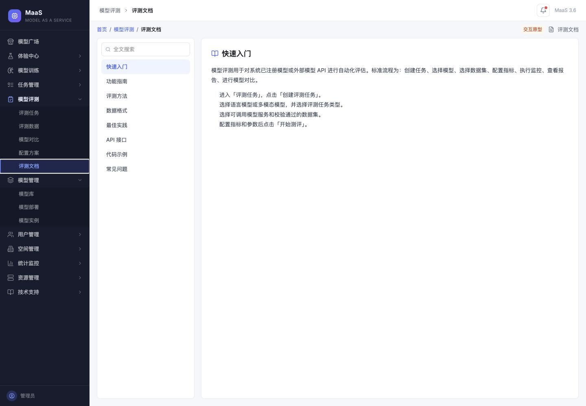

**原始需求依据**：在线文档中心。

**核心功能**：通过侧边栏导航提供快速入门、功能指南、最佳实践、常见问题和评测方法说明，并支持全文搜索。

**用户操作流程**：进入评测文档 → 选择导航模块或输入关键词 → 查看匹配页面和高亮内容 → 打开评测方法查看指标资料。

**内容规则**：每种指标说明计算原理、优点、缺点、适用场景和参考文献；文档至少包含快速入门、功能指南、最佳实践、常见问题。

**系统规则**：全文搜索覆盖标题和正文；结果列出相关文档页面；匹配内容高亮。

**交互设计**：搜索词输入后即时展示结果；支持清除搜索词；点击结果跳转对应文档模块。

**产品设计**：左侧固定结构化导航，右侧为可滚动正文；表格用于展示指标方法信息。

**异常处理**：无匹配结果时显示“未找到相关文档”；文档加载失败时提示刷新。

### 2.13 API 接口文档

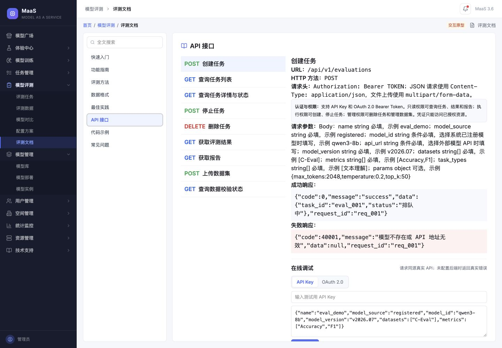

**原始需求依据**：API 接口文档。

**核心功能**：提供标准 RESTful API 列表和详情，覆盖创建任务、查询状态、获取结果/报告、停止/删除任务和上传/校验数据集，并提供在线调试。

**接口详情字段规则**：每个接口必须展示 URL、HTTP 方法、请求头、请求参数名称、类型、是否必填、示例值，以及成功和失败响应结构示例。

**认证与权限规则**：文档说明 API Key、OAuth 2.0 等认证方式；说明不同权限级别可访问的接口范围；凭证只能访问已授权资源。

**在线调试流程**：选择接口 → 填写认证信息和请求参数/上传文件 → 发送真实请求 → 查看 HTTP 状态和响应正文。

**系统规则**：调试工具必须调用真实后端接口，不得用固定延时或硬编码成功响应模拟；响应应区分成功和失败。

**交互设计**：左侧接口列表，右侧接口详情和调试区；POST 请求显示请求体；上传接口显示文件选择；调试按钮显示请求中状态。

**产品设计**：HTTP 方法使用颜色区分；请求和响应示例使用独立代码块；认证信息使用密码输入框。

**异常处理**：认证失败、参数错误、资源不存在、状态冲突和服务不可用时展示真实状态码与错误正文；未配置后端时明确提示当前环境不可调试。

### 2.14 代码示例库

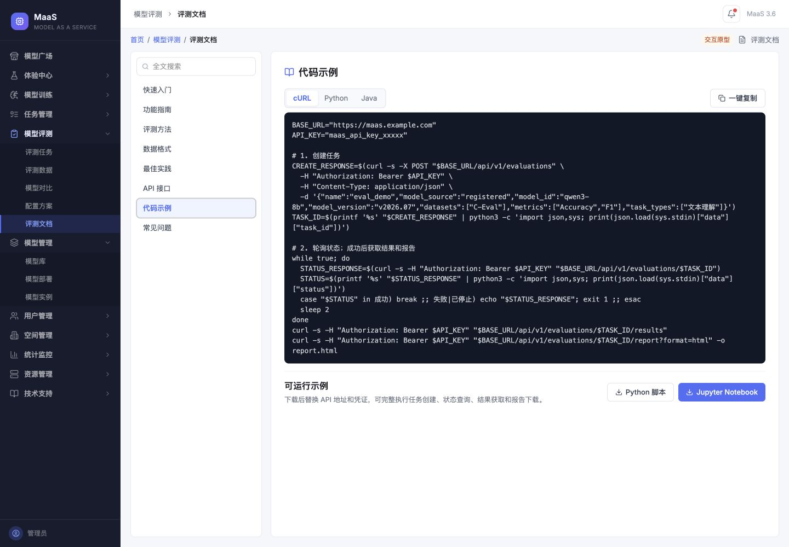

**原始需求依据**：代码示例库。

**核心功能**：提供 Python、cURL、Java 完整代码片段，覆盖任务创建、状态查询、结果获取和报告下载，并提供复制与示例项目下载。

**用户操作流程**：进入代码示例 → 切换语言 → 查看完整流程 → 点击“一键复制”，或下载 Python 脚本/Jupyter Notebook → 替换 API 地址与凭证后运行。

**内容规则**：三种语言示例必须覆盖从任务创建到结果获取的典型流程；代码块独立展示；提供至少一个可下载完整示例项目。

**系统规则**：复制内容与当前语言一致；下载文件内容完整且可打开；示例凭证使用占位值，不写入真实凭证。

**交互设计**：使用语言切换控件；代码块右上提供“一键复制”；下载区提供 Python 脚本和 Jupyter Notebook 按钮。

**产品设计**：代码使用等宽字体和深色代码区；长代码可滚动且不挤压页面布局。

**异常处理**：浏览器拒绝剪贴板权限时提示手动复制；下载失败时提示重试；代码示例加载失败时保留语言切换入口。

## 三、原始需求验收清单

| 原始需求分组 | 页面验收结果 |
|---|---|
| 多类型模型测评 | 创建任务支持语言/多模态类型联动、多任务选择、API/注册模型、版本、基础参数、开始测评、监控和资源占用 |
| 测评任务管理 | 列表显式展示任务 ID、名称、模型类型、版本、创建时间、状态和操作人；支持排序、筛选、实时搜索、查看、停止、删除 |
| 自动化报告与可视化 | 成功任务生成 PDF/HTML；包含规定章节；提供指标卡、雷达/柱状/折线图、图表交互、指标详情、CSV/Excel 导出 |
| 模型对比分析 | 专门入口；选择两个或多个完成任务；统一基准；保存场景；多栏、统一坐标、差异高亮、叠加雷达和摘要 |
| 测评数据集支持 | 公开数据集列表/详情/版本；上传数据集；数据格式校验与三种状态；公开/我的选用；团队共享与逻辑隔离 |
| 可配置化流程与指标 | 阶段/参数/顺序/依赖/跳过；模板共享、版本、回滚；指标分类、公式、组合、权重和方案应用 |
| 技术文档与支持 | 结构化导航、指标方法、全文搜索；REST API 详情与调试；API Key/OAuth 2.0；Python/cURL/Java 与项目下载 |
